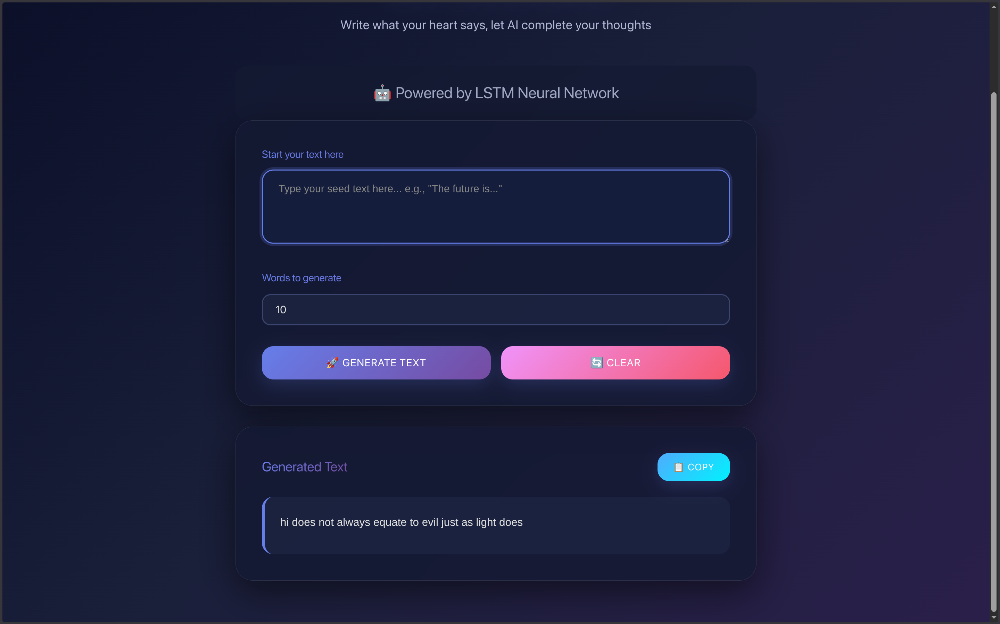

# LSTM powerd Text Prediction AI App 

A beautiful React app that uses an LSTM neural network to generate text completions based on user input.

# Interface


## Features

- on device LSTM neural network for text generation
- Word-by-word prediction
- Customizable number of words to generate


## Project Structure

```
/home/satam/facial/
├── text_completation/          # React Frontend
│   ├── src/
│   │   ├── App.jsx             # Main component
│   │   ├── App.css             # Styling with gradients
│   │   ├── index.css           # Global styles
│   │   └── main.jsx            # Entry point
│   ├── package.json
│   └── vite.config.js
│
└── backend/                    # Python Flask API
    ├── app.py                  # Flask server
    └── requirements.txt        # Python dependencies
```

## Setup Instructions

### 1. Backend Setup

```bash
cd /home/satam/facial/backend

# Install Python dependencies
pip install -r requirements.txt

# Run the Flask server
python app.py
```

The backend server will start on `http://localhost:5000`

### 2. Frontend Setup

```bash
cd /home/satam/facial/text_completation

# Install Node dependencies (if not already installed)
npm install

# Start development server
npm run dev
```

## How to Use

1. **Start both servers** (backend on 5000, frontend on 5173)
2. **Enter seed text** - Type the beginning of your text in the input box
3. **Set word count** - Choose how many words you want to generate (1-50)
4. **Click Generate** - The AI will predict and complete your text
5. **Copy result** - Click the Copy button to copy the generated text to clipboard

## API Endpoints

### POST `/generate`
Generate text based on seed text

**Request:**
```json
{
  "seed_text": "The future is",
  "n_words": 10
}
``` 

**Response:**
```json
{
  "success": true,
  "generated_text": "The future is bright and full of possibilities",
  "seed_text": "The future is",
  "words_generated": 10
}
```

### GET `/health`
Check if the server and model are running

**Response:**
```json
{
  "status": "ok",
  "model_loaded": true,
  "tokenizer_loaded": true
}
```

## Technologies Used

**Frontend:**
- React 19
- Vite (build tool)
- CSS3 (gradients, animations, curves)

**Backend:**
- Flask (Python web framework)
- TensorFlow & Keras (LSTM model)
- CORS (cross-origin requests)

## Color Palette

- **Primary:** Purple to Violet (#667eea → #764ba2)
- **Secondary:** Pink to Red (#f093fb → #f5576c)
- **Tertiary:** Blue to Cyan (#4facfe → #00f2fe)
- **Background:** Light gradient blue

## Customization

### Change Colors
Edit the CSS variables in [App.css](src/App.css):
```css
:root {
  --primary-gradient: linear-gradient(135deg, #667eea 0%, #764ba2 100%);
  --secondary-gradient: linear-gradient(135deg, #f093fb 0%, #f5576c 100%);
  --tertiary-gradient: linear-gradient(135deg, #4facfe 0%, #00f2fe 100%);
}
```

### Adjust Model Paths
In [backend/app.py](backend/app.py), update these paths if needed:
- Model: `/home/satam/Downloads/lstm_model.h5`
- Tokenizer: `/home/satam/facial/Tokenizer.pkl`

## Troubleshooting

**"Failed to connect to server"**
- Make sure Flask backend is running on port 5000
- Check CORS is enabled in Flask

**"Model or tokenizer not loaded"**
- Verify model and tokenizer file paths in app.py
- Check file permissions

**Frontend not updating**
- Clear browser cache
- Hard refresh (Ctrl+Shift+R or Cmd+Shift+R)

## Build for Production

```bash
# Build React app
cd text_completation
npm run build

# Build output in dist/ folder
```

## License

MIT License - Feel free to use and modify

--
X